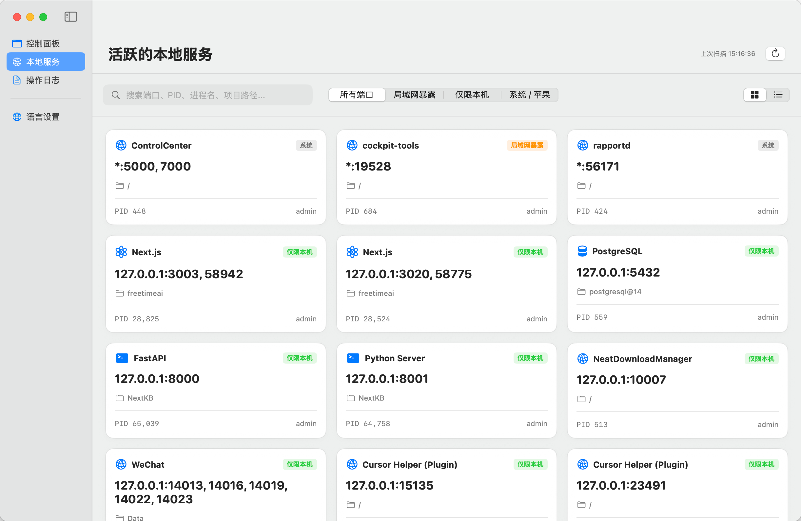

# PortDeck — macOS 本地服务控制台

PortDeck 是一款面向 macOS 开发者的本地开发服务控制台。它采用**纯原生 SwiftUI** 构建，专门针对 Apple Silicon (M 芯片) 进行性能优化，保证超轻量、低功耗、不常驻后台，内存占用控制在几十兆级别。

## 产品预览



## 🌟 核心功能

1. **本地服务监控与优雅关闭 (SIGTERM / SIGKILL)**
   - 一眼查看当前 Mac 正在监听的所有本地端口服务（如 `127.0.0.1:xxxx` 或 `0.0.0.0:xxxx`）。
   - **项目来源感知 (Project-aware)**：自动识别服务所属的工作目录（Cwd）、父进程（Parent Process）以及完整启动命令参数（如 `npm run dev`）。
   - **多因子框架识别**：通过“进程名 + 命令行参数 + 工作目录特征文件”智能推断服务类型（如 Next.js, Vite, FastAPI, Django, Ollama 等）。
   - **优雅关闭机制**：优先向进程发送 `SIGTERM` (kill -15)，若 3 秒内未退出，提供红色 `SIGKILL` (kill -9) 按钮进行手动二次确认强杀。

2. **系统垃圾轻量清理**
   - 智能统计废纸篓 (`~/.Trash`) 的文件数量与总占用空间。
   - 提供“在 Finder 中打开回收站”的按钮，清空废纸篓时使用系统 Finder AppleScript 安全执行，保证行为合规且安全。

3. **操作安全日志与系统进程保护**
   - 默认**不需要管理员权限 (No Root Privilege)**，仅管理当前用户级别的开发进程。
   - 对系统级进程（位于 `/System`、`/usr/sbin` 等目录）及拥有 Apple 官方代码签名的进程默认进行**杀死屏蔽保护**，防止误伤系统关键服务。
   - 所有破坏性操作（如 SIGKILL、清空废纸篓）自动记录到本地日志文件 `~/Library/Logs/PortDeck/actions.json` 中，并在应用内提供“操作日志”面板供随时回溯。

---

## 📂 项目结构

```
PortDeck/
├── Package.swift            # Swift Package Manager 配置
├── package.sh               # 一键编译与打包为 Mac .app 安装包的脚本
├── LICENSE                  # GPL-3.0 许可证
├── README.md                # 本说明文档
├── home.png                 # 产品预览图
├── AppIcon.icns             # 应用图标
├── Assets/                  # 图标源文件与 iconset
├── DESIGN.md                # 设计规范
├── prd.md                   # 产品需求文档 (PRD)
└── Sources/                 # 纯原生 Swift 源代码
    ├── PortDeckApp.swift    # App 入口与菜单栏
    ├── ContentView.swift    # 侧边栏布局与状态中枢
    ├── DashboardView.swift  # 状态看板与操作推荐
    ├── PortsView.swift      # 端口列表（卡片/表格）
    ├── ProcessDetailDrawer.swift  # 进程详情与 Stop 操作
    ├── ActionLogView.swift  # 操作日志面板
    ├── SettingsView.swift   # 设置（语言/刷新间隔）
    ├── AppState.swift       # 全局状态
    ├── Localization.swift   # 中英文本地化
    ├── SharedUI.swift       # 共用 UI 组件
    ├── PortService.swift    # 端口扫描与框架识别
    ├── TrashService.swift   # 废纸篓扫描与清理
    ├── ActionLogService.swift # 本地操作日志
    └── Theme.swift          # 视觉主题
```

---

## 🛠 编译与运行

由于项目采用标准 Swift Package Manager 结合简易打包脚本，您可以极其简单地在本地完成编译和分发。

### 1. 一键编译与打包
在项目根目录下执行以下命令：
```bash
./package.sh
```
该脚本将：
- 使用生产配置 (`release` 模式) 编译原生 `arm64` macOS 二进制文件。
- 在根目录创建标准的苹果应用包：`PortDeck.app`。
- 生成规范的 `Info.plist` 元数据。

### 2. 运行应用
打包完成后，直接使用命令行启动应用，或者双击 Finder 中的 `PortDeck.app`：
```bash
open PortDeck.app
```

---

## ⚡ 性能表现 (Apple Silicon)

- **CPU 占用**：闲置或后台时为 **0%**；执行刷新扫描时，GCD 会将任务倾向性地派发给能效核 (E-Cores)，瞬时占用极小，绝不引发发热与电池损耗。
- **内存占用**：运行时物理内存稳定在约 **30MB - 50MB**，极其轻量。
- **启动速度**：冷启动到首屏完全渲染耗费时间 **< 0.5 秒**。

---

## 📄 许可证

本项目采用 [GNU General Public License v3.0](./LICENSE)（GPL-3.0）开源协议。
